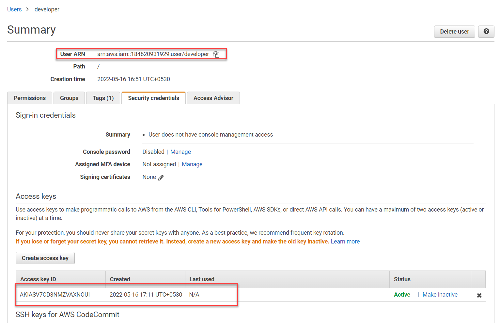

# Terraform 

Terraform is an Infrastructure as a Code that helps users to define and deploy both cloud and on-premise resources. It is introduced by Hashicorp - a software company which provides open-source and commercial tools for developers, administrator and end users to build and run services on cloud. Terraform can be used to automate the deployment workflow for low level resources such as VMs, Storage, networking and high-level resources such as DNS entries and SaaS solutions.

Terraform allows users to deploy resoruces on almost every cloud service providers including AWS, Azure, Google,Kubernetes, Helm, GitHub, Splunk, DataDog and more. Terraform configurations deploys resources virtually on any platform using their own Application Programming Interface (API). You can find the Terraform providers and the modules in [Terraform registry](https://registry.terraform.io/).


## Terraform Workflow stages
The core Terraform workflow consists of three stages:
* **Write**: You define resources, which may be across multiple cloud providers and services. For example, you might create a configuration to deploy an application on virtual machines in a Virtual Private Cloud (VPC) network with security groups and a load balancer.
* **Plan**: Terraform creates an execution plan describing the infrastructure it will create, update, or destroy based on the existing infrastructure and your configuration.
* **Apply**: On approval, Terraform performs the proposed operations in the correct order, respecting any resource dependencies. For example, if you update the properties of a VPC and change the number of virtual machines in that VPC, Terraform will recreate the VPC before scaling the virtual machines.


## Advantages of Terraform workflows
* **Manage any infrastructure**<br/> 
You can find over 1000+ providers in the Terraform registry, which means you can deploy resources in almost every cloud provider. You can also write your own. Terraform takes an immutable approach to infrastructure, reducing the complexity of upgrading or modifying your services and infrastructure.
* **Track your infrastructure**<br/>
Terraform generates a plan and prompts you for your approval before modifying your infrastructure. It also keeps track of your real infrastructure in a state file, which acts as a source of truth for your environment. Terraform uses the state file to determine the changes to make to your infrastructure so that it will match your configuration.
* **Automate changes**<br/>
Terraform configuration files are declarative, meaning that they describe the end state of your infrastructure. You do not need to write step-by-step instructions to create resources because Terraform handles the underlying logic. Terraform builds a resource graph to determine resource dependencies and creates or modifies non-dependent resources in parallel. This allows Terraform to provision resources efficiently.
* **Standardize configurations**<br/>
Terraform supports reusable configuration components called modules that define configurable collections of infrastructure, saving time and encouraging best practices. You can use publicly available modules from the Terraform Registry, or write your own.
* **Collaborate**<br/>
Since your configuration is written in a file, you can commit it to a Version Control System (VCS) and use Terraform Cloud to efficiently manage Terraform workflows across teams. Terraform Cloud runs Terraform in a consistent, reliable environment and provides secure access to shared state and secret data, role-based access controls, a private registry for sharing both modules and providers, and more.

## Working with Terraform 
Users can use Terraform to create and deploy resources on any cloud. User can use **Terraform CLI** or **Terraform CDK (CDKTF)** to define and deploy resources. 
### Terraform CLI
Terraform Command Line Interface (CLI) allows you to create and manage resources using commands and Terraform configuration file. Terraform CLI uses `terraform` command to execute actions and offers a set of subcommands such as `terraform init` and `terraform apply`. Terraform CLI is available for all platforms including Windows, Mac and Linux. You can install Terraform on Windows using pre-compiled binaries or using `chocolatey` installer. For Mac OS you can use `Homebrew` installer or precompiled binary. Linux users can use the native package installers for the Linux editions or use the binaries. You may need to set the environment variables to make the `terraform` command accessible from all paths.    

### Terraform CDK (CDKTF)
Cloud Development Kit for Terraform (CDKTF) allows you to use familiar programming languages to define and provision infrastructure. This gives you access to the entire Terraform ecosystem without learning HashiCorp Configuration Language (HCL) and lets you leverage the power of your existing toolchain for testing, dependency management, etc. Terraform CDK currently supports TypeScript, Python, Java, C#, and Go (experimental).

## Terraform Editions
Terraform is available in three editions:
### Terraform Open-source
Terraform open source is a free, downloadable tool that you interact with on the command line. It lets you provision infrastructure on any cloud provider and manages configuration, plugins, infrastructure, and state.
### Terraform Cloud
Terraform Cloud is a SaaS application that runs Terraform in a stable, remote environment and securely stores state and secrets. It includes a rich user interface that helps you better understand your Terraform operations and resources, allows you to define role-based access controls, and offers a private registry for sharing modules and providers. Terraform Cloud also integrates with the Terraform CLI and connects to common version control systems (VCS) like GitHub, GitLab, and Bitbucket. When you connect a Terraform Cloud workspace to a VCS repository, new commits and changes can automatically trigger Terraform plans. Terraform Cloud also offers an API, allowing you to integrate it into existing workflows. Most of the common features are free for small teams, but paid plans are available for larger organizations with additional collaboration and governance features.
### Terraform Enterprise
Terraform Enterprise allows you to set up a self-hosted distribution of Terraform Cloud. It offers customizable resource limits and is ideal for organizations with strict security and compliance requirements. Terraform Enterprise allows you to set up a private instance of Terraform Cloud with dedicated support from HashiCorp. It allows you to accommodate advanced security and compliance requirements. 

## Terraform Language 
Terraform language is used to write the Terraform configurations. Terraform configuration language is relevant for Terraform CLI, Terraform Cloud and Terraform Enterprise. Configuration files you write in Terraform language tell Terraform what plugins to install, what infrastructure to create, and what data to fetch. Terraform language also lets you define dependencies between resources and create multiple similar resources from a single configuration block. The main purpose of the Terraform language is declaring resources, which represent infrastructure objects. All other language features exist only to make the definition of resources more flexible and convenient. A Terraform configuration is a complete document in the Terraform language that tells Terraform how to manage a given collection of infrastructure. A configuration can consist of multiple files and directories.
```terraform
<BLOCK TYPE> "<BLOCK LABEL>" "<BLOCK LABEL>" {
  # Block body
  <IDENTIFIER> = <EXPRESSION> # Argument
}
```

For example

```terraform
resource "aws_vpc" "main" {
  cidr_block = var.base_cidr_block
}
```
You can read more about the HashiCorp Configuration Language (HCL) [here](HCL.md)

## Installing and configuring Terraform CLI
In this demo we are going to install Terraform CLI using the pre-compiled binary on Windows. 
1) Open browser and navigate to [terraform CLI](https://www.terraform.io/downloads) webpage. Download the Windows version of the Terraform CLI zip file.  
2) Extract the zip file. Terraform runs as a single binary named `terraform`. Any other files in the package can be safely removed and Terraform will still function. Finally, make sure that the terraform binary is available on your `PATH`.
3) Test the installation of terraform using the following command:
    ```bash
    terraform -v
    ```
4) Create a folder with name `terraform-demo` and add a file `sample.tf` inside it.
5) Add the following code to it.
    ```bash
    provider "aws" {
        profile = "default"
        region = "ap-south-1"
    }
    resource "aws_iam_user" "devuser" {
        name = "developer"
        tags = {
            Name = "Developer User"
        }
    }
    ```
    This will use the `default` AWS profile to authenticate. It uses the `ap-south-1` region to deploy resources.
6) Open the terminal and set the path to `terraform-demo` folder. Run the following command from the root folder.
    ```bash
    terraform init
    ```
7) The above command will scan the code to identify the provider you are using. By default, the provider code will be downloaded into a `.terraform` folder, which is Terraform’s scratch directory.
8) Run the `terraform plan` command that allows you see what Terraform will do before actually doing it.
    ```bash
    terraform plan
    ```
    The output of the plan command is a little like the output of the diff command: resources with a plus sign (+) are going to be created, resources with a minus sign (-) are going to be deleted, and resources with a tilde sign (~) are going to be modified in-place.
    ```
    PS ~/terraform-demo> terraform plan

    Terraform used the selected providers to generate the following execution plan. Resource actions are indicated with the
    following symbols:
      + create
    
    Terraform will perform the following actions:
    
      # aws_iam_user.devuser will be created
      + resource "aws_iam_user" "devuser" {
          + arn           = (known after apply)
          + force_destroy = false
          + id            = (known after apply)
          + name          = "developer"
          + path          = "/"
          + tags          = {
              + "Name" = "Developer User"
            }
          + tags_all      = {
              + "Name" = "Developer User"
            }
          + unique_id     = (known after apply)
        }
    
    Plan: 1 to add, 0 to change, 0 to destroy.
    ```
9) Now, you can run the `apply` command create the instances. 
    ```bash
    PS C:\Users\sonus\Desktop\terraform-demo> terraform apply

    Terraform used the selected providers to generate the following execution plan. Resource actions are indicated with the following symbols:
      + create
    
    Terraform will perform the following actions:
    
      # aws_iam_user.devuser will be created
      + resource "aws_iam_user" "devuser" {
          + arn           = (known after apply)
          + force_destroy = false
          + id            = (known after apply)
          + name          = "developer"
          + path          = "/"
          + tags          = {
              + "Name" = "Developer User"
            }
          + tags_all      = {
              + "Name" = "Developer User"
            }
          + unique_id     = (known after apply)
        }
    
    Plan: 1 to add, 0 to change, 0 to destroy.
    
    Do you want to perform these actions?
      Terraform will perform the actions described above.
      Only 'yes' will be accepted to approve.
    
      Enter a value:
    ```
    Type `yes` to create the resources defined in the configuration file. The above example creates an IAM user in the AWS account.
10) Update the configuration to add an ACCESS KEY for the new user. Add the `resource` configuration to create an access key for the user.
    ```terraform    
    provider "aws" {
        profile = "default"
        region = "ap-south-1"
    }
    
    resource "aws_iam_user" "devuser" {
        name = "developer"
        tags = {
            Name = "Developer User"
        }
    }
    
    resource "aws_iam_access_key" "devuser_key" {
        user = "developer"
    } 
    ```
11) Run the `terraform apply` command to update the changes in AWS account. Type `yes` to confirm the changes.
12) You can view the Access Keys under the `Security Credentials` tab.
    

